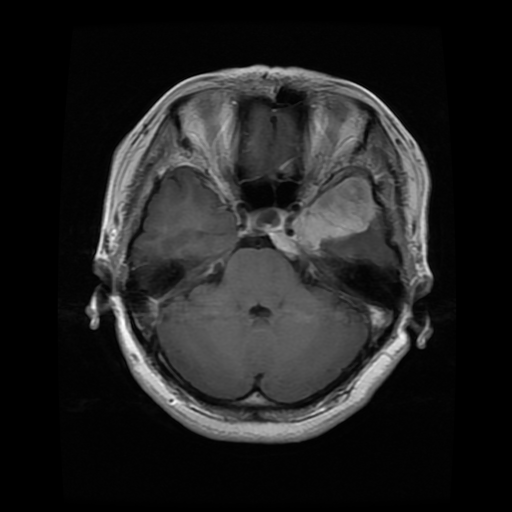
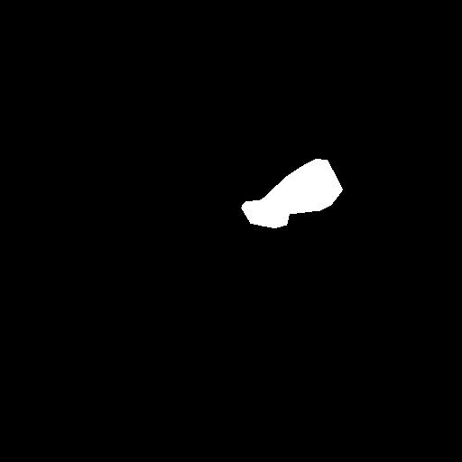

# Brain Tumor Segmentation using tensorflow

This repository contains the code for semantic segmentation on the Brain Tumor Segmentation dataset using TensorFlow 2.0 framework.
The following models are used:
- [UNET](https://arxiv.org/abs/1505.04597)

# Dataset
Dataset link: https://www.kaggle.com/datasets/nikhilroxtomar/brain-tumor-segmentation

# Example Output

Original Image             |  Ground Truth          
:-------------------------:|:-------------------------:
  |   |
